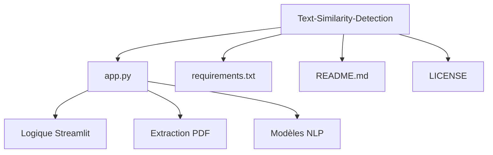

# 🔎 Détecteur de Similarité NLP


Une application web interactive permettant de comparer la similarité sémantique et lexicale entre deux textes ou documents PDF. Ce projet utilise plusieurs approches de Traitement du Langage Naturel (NLP), allant des méthodes statistiques classiques aux modèles de Deep Learning modernes.

---

## 📋 Fonctionnalités

L'application propose trois moteurs d'analyse distincts :

1.  **TF-IDF (Statistique) :**
    *   Analyse basée sur la fréquence des termes (Term Frequency - Inverse Document Frequency).
    *   Idéal pour la détection de plagiat littéral (copier-coller).
    *   **Options :** Support des N-grams (1 à 4) pour capturer des séquences de mots.

2.  **Word2Vec (Sémantique Simple - GloVe) :**
    *   Utilise des plongements de mots (embeddings) pré-entraînés (_glove-wiki-gigaword-50_).
    *   Calcule la moyenne des vecteurs de chaque mot pour former un vecteur de document.
    *   Capable de détecter des synonymes simples.

3.  **Sentence-BERT (Sémantique Avancée) :**
    *   Utilise le modèle _Transformer_ `all-MiniLM-L6-v2`.
    *   Comprend le contexte global et le sens profond des phrases.
    *   La méthode la plus robuste pour la détection de paraphrase.

### Autres atouts :
*   📄 **Support PDF :** Extraction automatique du texte depuis des fichiers PDF uploadés.
*   🧹 **Prétraitement :** Nettoyage automatique du texte (minuscules, suppression de la ponctuation et caractères spéciaux).
*   📊 **Visualisation :** Jauges de progression et alertes visuelles selon le degré de similitude.

---

## 🚀 Installation

Il est recommandé d'utiliser un environnement virtuel pour ne pas polluer votre système global.

### 1. Cloner le projet
```bash
git clone https://github.com/votre-utilisateur/Text-Similarity-Detection.git
cd Text-Similarity-Detection
```

### 2. Créer un environnement virtuel
```bash
# Windows
python -m venv venv
venv\Scripts\activate

# Mac/Linux
python3 -m venv venv
source venv/bin/activate
```

### 3. Installer les dépendances
```bash
pip install -r requirements.txt
```

> **Note :** Le premier lancement peut être légèrement plus long car l'application téléchargera les modèles nécessaires (GloVe et Sentence-BERT) pour les mettre en cache.

---

## 💻 Utilisation

Une fois l'installation terminée, lancez l'application avec Streamlit :

```bash
streamlit run app.py
```

L'application s'ouvrira automatiquement dans votre navigateur par défaut (généralement à l'adresse `http://localhost:8501`).

1.  Sélectionnez la **méthode de comparaison** (TF-IDF, Word2Vec ou BERT).
2.  Entrez votre texte dans les zones dédiées ou **uploadez des fichiers PDF**.
3.  Cliquez sur **"Lancer l'analyse"**.
4.  Consultez le score de similarité et l'interprétation.

---

## 📂 Structure du Projet



*   `app.py` : Le cœur de l'application contenant l'interface et la logique.
*   `requirements.txt` : Liste des librairies Python requises.

---

## 🛠️ Technologies Utilisées

*   **[Streamlit](https://streamlit.io/)** : Interface utilisateur rapide et interactive.
*   **[Scikit-learn](https://scikit-learn.org/)** : Pour TF-IDF et le calcul de similarité cosinus.
*   **[Sentence-Transformers](https://www.sbert.net/)** : Pour l'implémentation de BERT.
*   **[Gensim](https://radimrehurek.com/gensim/)** : Pour le téléchargement et l'utilisation de Word2Vec/GloVe.
*   **[PyPDF](https://pypi.org/project/pypdf/)** : Pour la lecture des fichiers PDF.

---

## 📝 Licence

Ce projet est sous licence MIT. Voir le fichier [LICENSE](LICENSE) pour plus de détails.

**Auteur :** Mohamed ZAHZOUH
Copyright (c) 2025
